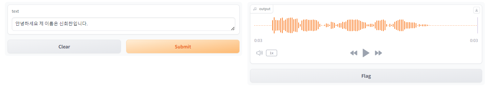

# Project_TTS_STT_Flask
Tacotron2를 활용한 한국 5개 지역의 사투리로 말하는 인공지능 모델

 

 

   
## Object

Tacotron2는 텍스트를 음성으로 변환하는 딥러닝 기반의 신경망 모델입니다.

또한 Whisper는 자연스러운 대화형 응답을 생성하는 OpenAI의 언어 모델입니다.

우리는 이 모델들을 이용해서 Text와 Speak 사이를 자유롭게 변환할 수 있습니다.

결과적으로 Text를 원하는 사투리로 읽어주는 모델까지의 학습을 목표로 합니다.

   
## Dataset

[Github] IT_korea_Academy : leelang7 - torch-hybrid-tacotron2  
[AI허브] 한국어 방언 발화 데이터셋 - 강원도, 제주도, 충청도, 경상도, 전라도

   
## 사전 학습 모델 다운로드

1. AI허브 회원가입 - 데이터셋 상세 페이지 - 활용 AI 모델 및 코드 - AI 모델 다운로드

2. 압축 해제 - 03.AI모델 - 1. Binary File - 음성합성 - `acoustic.ckpt`, `vocoder.ckpt`

3. `logs/model` 폴더 저장

   
## Result

- 본 학습 진행 결과 TTS, STT 과정의 Workflow는 학습하였으며 전반적인 변환 과정에 대한 이해를 목표로 진행하였다.
- 다만, 전체적인 모델 구축에 어려움이 있어 관련 프로그램을 참고하여 진행한 데에는 한계가 있으며 이후 보완이 필요할 것으로 판단됩니다. 
